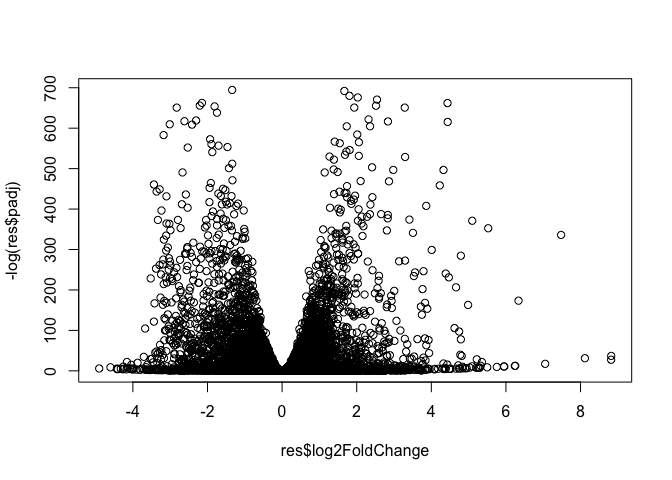
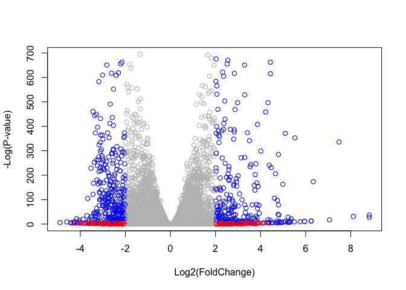

<style> 
h1, .h1 {
    margin-top: 50px;
}
h2, .h2, h3, .h3 {
    margin-top: 30px;
}

</style> 


**BIMM-143 Lecture 16:**  
Barry Grant &lt; <http://thegrantlab.org/bimm143/> &gt;  
2018-11-26   (14:03:01 PST on Mon, Nov 26)  
  


# Overview
Analysis of high-throughput biological data typically yields a list of genes or proteins requiring further interpretation - for example the ranked lists of differentially expressed genes we have been generating from our RNA-seq analysis to date. 

Our intention is typically to use such lists to gain novel insights about genes and proteins that may have roles in a given phenomenon, phenotype or disease progression. However, in many cases these 'raw' gene lists are challenging to interpret due to their large size and lack of useful annotations. Hence, our expensively assembled gene lists often fail to convey the full degree of possible insight about the condition being studied. 

Pathway analysis (also known as gene set analysis or over-representation analysis), aims to reduce the complexity of interpreting gene lists via mapping the listed genes to known (i.e. annotated) biological pathways, processes and functions. 

> **Side-note**: Pathway analysis can actually mean many different things to different people. This includes analysis of Gene Ontology (GO) terms, protein–protein interaction networks, flux-balance analysis from kinetic simulations of pathways, etc. However, pathway analysis most commonly focuses on methods that exploit existing pathway knowledge (e.g. in public repositories such as GO or KEGG), rather than on methods that infer pathways from molecular measurements. These more general approaches are nicely reviewed in this paper: 
>
> - Khatri, et al. "*Ten years of pathway analysis: current approaches and outstanding challenges*." [PLoS Comput Biol 8.2 (2012): e1002375](http://journals.plos.org/ploscompbiol/article?id=10.1371/journal.pcbi.1002375).

## Patway analysis with R and Bioconductor
There are many freely available tools for pathway or over-representation analysis. As of Nov 2017 Bioconductor alone has over [80 packages categorized under gene set enrichment](http://bioconductor.org/packages/release/BiocViews.html#___GeneSetEnrichment) and over [120 packages categorized under pathways](http://bioconductor.org/packages/release/BiocViews.html#___Pathways). 

Here we play with just one, the [**GAGE** package](https://bioconductor.org/packages/release/bioc/html/gage.html) (which stands for **G**enerally **A**pplicable **G**ene set **E**nrichment), to do KEGG pathway enrichment analysis on RNA-seq based differential expression results.

The [KEGG pathway database](http://www.genome.jp/kegg/pathway.html), unlike GO for example, provides functional annotation as well as information about gene products that interact with each other in a given pathway, how they interact (e.g., activation, inhibition, etc.), and where they interact (e.g., cytoplasm, nucleus, etc.). Hence KEGG has the potential to provide extra insight beyond annotation lists of simple molecular function, process etc. from GO terms. 

In this analysis, we check for coordinated differential expression over gene sets from KEGG pathways instead of changes of individual genes. The assumption here is that consistent perturbations over a given pathway (gene set) may suggest mechanistic changes.


## About our Input Data

The data for for hands-on session comes from GEO entry: [GSE37704](http://www.ncbi.nlm.nih.gov/geo/query/acc.cgi?acc=GSE37704), which is associated with the following publication: 

- Trapnell C, Hendrickson DG, Sauvageau M, Goff L et al. "*Differential analysis of gene regulation at transcript resolution with RNA-seq*". Nat Biotechnol 2013 Jan;31(1):46-53. [PMID: 23222703](https://www.ncbi.nlm.nih.gov/pubmed/23222703)

The authors report on differential analysis of lung fibroblasts in response to loss of the developmental transcription factor HOXA1. Their results and others indicate that HOXA1 is required for lung fibroblast and HeLa cell cycle progression. In particular their analysis show that "loss of HOXA1 results in significant expression level changes in thousands of individual transcripts, along with isoform switching events in key regulators of the cell cycle". For our session we have used their [Sailfish](https://www.nature.com/articles/nbt.2862) gene-level estimated counts and hence are restricted to protein-coding genes only. 


# Section 1. Differential Expression Analysis 

You can download the count data and associated metadata from here: [GSE37704_featurecounts.csv](https://bioboot.github.io/bimm143_W18/class-material/GSE37704_featurecounts.csv) and [GSE37704_metadata.csv](https://bioboot.github.io/bimm143_W18/class-material/GSE37704_metadata.csv). This is similar to our starting point for the last class where we used DESeq2 for the first time. We will use it again today!


```r
library(DESeq2)
```

Load our data files


```r
metaFile <- "data/GSE37704_metadata.csv"
countFile <- "data/GSE37704_featurecounts.csv"

# Import metadata and take a peak
colData = read.csv(metaFile, row.names=1)
head(colData)
```

<div data-pagedtable="false">
  <script data-pagedtable-source type="application/json">
{"columns":[{"label":[""],"name":["_rn_"],"type":[""],"align":["left"]},{"label":["condition"],"name":[1],"type":["fctr"],"align":["left"]}],"data":[{"1":"control_sirna","_rn_":"SRR493366"},{"1":"control_sirna","_rn_":"SRR493367"},{"1":"control_sirna","_rn_":"SRR493368"},{"1":"hoxa1_kd","_rn_":"SRR493369"},{"1":"hoxa1_kd","_rn_":"SRR493370"},{"1":"hoxa1_kd","_rn_":"SRR493371"}],"options":{"columns":{"min":{},"max":[10]},"rows":{"min":[10],"max":[10]},"pages":{}}}
  </script>
</div>

```r
# Import countdata
countData = read.csv(countFile, row.names=1)
head(countData)
```

<div data-pagedtable="false">
  <script data-pagedtable-source type="application/json">
{"columns":[{"label":[""],"name":["_rn_"],"type":[""],"align":["left"]},{"label":["length"],"name":[1],"type":["int"],"align":["right"]},{"label":["SRR493366"],"name":[2],"type":["int"],"align":["right"]},{"label":["SRR493367"],"name":[3],"type":["int"],"align":["right"]},{"label":["SRR493368"],"name":[4],"type":["int"],"align":["right"]},{"label":["SRR493369"],"name":[5],"type":["int"],"align":["right"]},{"label":["SRR493370"],"name":[6],"type":["int"],"align":["right"]},{"label":["SRR493371"],"name":[7],"type":["int"],"align":["right"]}],"data":[{"1":"918","2":"0","3":"0","4":"0","5":"0","6":"0","7":"0","_rn_":"ENSG00000186092"},{"1":"718","2":"0","3":"0","4":"0","5":"0","6":"0","7":"0","_rn_":"ENSG00000279928"},{"1":"1982","2":"23","3":"28","4":"29","5":"29","6":"28","7":"46","_rn_":"ENSG00000279457"},{"1":"939","2":"0","3":"0","4":"0","5":"0","6":"0","7":"0","_rn_":"ENSG00000278566"},{"1":"939","2":"0","3":"0","4":"0","5":"0","6":"0","7":"0","_rn_":"ENSG00000273547"},{"1":"3214","2":"124","3":"123","4":"205","5":"207","6":"212","7":"258","_rn_":"ENSG00000187634"}],"options":{"columns":{"min":{},"max":[10]},"rows":{"min":[10],"max":[10]},"pages":{}}}
  </script>
</div>

Hmm... remember that we need the `countData` and `colData` files to match up so we will need to remove that odd first column in `countData` namely `contData$length`.

> **Q**. Complete the code below to remove the troublesome first column from `countData`


```r
# Note we need to remove the odd first $length col
countData <- as.matrix(countData[,___])
head(countData)
```


```
##                 SRR493366 SRR493367 SRR493368 SRR493369 SRR493370
## ENSG00000186092         0         0         0         0         0
## ENSG00000279928         0         0         0         0         0
## ENSG00000279457        23        28        29        29        28
## ENSG00000278566         0         0         0         0         0
## ENSG00000273547         0         0         0         0         0
## ENSG00000187634       124       123       205       207       212
##                 SRR493371
## ENSG00000186092         0
## ENSG00000279928         0
## ENSG00000279457        46
## ENSG00000278566         0
## ENSG00000273547         0
## ENSG00000187634       258
```

This looks better but there are lots of zero entries in there so let's get rid of them as we have no data for these.

> **Q**. Complete the code below to filter `countData` to exclude genes (i.e. rows) where we have 0 read count across all samples (i.e. columns).
> 
> Tip: What will **rowSums()** of `countData` return and how could you use it in this context?


```r
# Filter count data where you have 0 read count across all samples.
countData = countData[___, ]
head(countData)
```


```
##                 SRR493366 SRR493367 SRR493368 SRR493369 SRR493370
## ENSG00000279457        23        28        29        29        28
## ENSG00000187634       124       123       205       207       212
## ENSG00000188976      1637      1831      2383      1226      1326
## ENSG00000187961       120       153       180       236       255
## ENSG00000187583        24        48        65        44        48
## ENSG00000187642         4         9        16        14        16
##                 SRR493371
## ENSG00000279457        46
## ENSG00000187634       258
## ENSG00000188976      1504
## ENSG00000187961       357
## ENSG00000187583        64
## ENSG00000187642        16
```

## Running DESeq2

Nice now lets setup the DESeqDataSet object required for the **DESeq()** function and then run the DESeq pipeline. This is again similar to our last days hands-on session.


```r
dds = DESeqDataSetFromMatrix(countData=countData,
                             colData=colData,
                             design=~condition)
dds = DESeq(dds)
```

```
## estimating size factors
```

```
## estimating dispersions
```

```
## gene-wise dispersion estimates
```

```
## mean-dispersion relationship
```

```
## final dispersion estimates
```

```
## fitting model and testing
```

```r
dds
```

```
## class: DESeqDataSet 
## dim: 15280 6 
## metadata(1): version
## assays(4): counts mu H cooks
## rownames(15280): ENSG00000279457 ENSG00000187634 ...
##   ENSG00000276345 ENSG00000271254
## rowData names(22): baseMean baseVar ... deviance maxCooks
## colnames(6): SRR493366 SRR493367 ... SRR493370 SRR493371
## colData names(2): condition sizeFactor
```

Next, get results for the HoxA1 knockdown versus control siRNA (remember that these were labeled as "**hoxa1_kd**" and "**control_sirna**" in our original `colData` metaFile input to DESeq, you can check this above and by running `resultsNames(dds)` command). 


```r
res = results(dds, contrast=c("condition", "hoxa1_kd", "control_sirna"))
```

> **Q**. Call the **summary()** function on your results to get a sense of how many genes are up or down-regulated at the default 0.1 p-value cutoff.


```r
summary(___)
```


```
## 
## out of 15280 with nonzero total read count
## adjusted p-value < 0.1
## LFC > 0 (up)       : 4351, 28%
## LFC < 0 (down)     : 4399, 29%
## outliers [1]       : 0, 0%
## low counts [2]     : 590, 3.9%
## (mean count < 1)
## [1] see 'cooksCutoff' argument of ?results
## [2] see 'independentFiltering' argument of ?results
```

## Volcono plot

Now we will make a volcano plot, a commonly produced visualization from this type of data that we introduced last day. Basically it's a plot of log2 fold change vs -log adjusted p-value.


```r
plot( res$log2FoldChange, -log(res$padj) )
```

<!-- -->

> **Q**. Improve this plot by completing the below code, which adds color and axis labels


```r
# Make a color vector for all genes
mycols <- rep("gray", nrow(res) )

# Color red the genes with absolute fold change above 2
mycols[ abs(res$log2FoldChange) > 2 ] <- "red"

# Color blue those with adjusted p-value less than 0.01
#  and absolute fold change more than 2
inds <- (___) & (abs(res$log2FoldChange) > 2 )
mycols[ inds ] <- "blue"

plot( res$log2FoldChange, -log(res$padj), col=___, xlab="Log2(FoldChange)", ylab="-Log(P-value)" )
```

<!-- -->

## Adding gene annotation

Since we mapped and counted against the Ensembl annotation, our results only have information about Ensembl gene IDs. However, our pathway analysis downstream will use KEGG pathways, and genes in KEGG pathways are annotated with Entrez gene IDs. So lets add them as we did the last day. 

> **Q**. Use the **mapIDs()** function multiple times to add SYMBOL, ENTREZID and GENENAME annotation to our results by completing the code below.


```r
library("AnnotationDbi")
library("org.Hs.eg.db")

columns(org.Hs.eg.db)

res$symbol = mapIds(org.Hs.eg.db,
                    keys=___, 
                    keytype="ENSEMBL",
                    column=___,
                    multiVals="first")

res$entrez = mapIds(org.Hs.eg.db,
                    keys=___,
                    keytype="ENSEMBL",
                    column="ENTREZID",
                    multiVals="first")

res$name =   mapIds(org.Hs.eg.db,
                    keys=row.names(res),
                    keytype=___,
                    column=___,
                    multiVals="first")

head(res, 10)
```


```
## log2 fold change (MLE): condition hoxa1_kd vs control_sirna 
## Wald test p-value: condition hoxa1 kd vs control sirna 
## DataFrame with 10 rows and 9 columns
##                         baseMean     log2FoldChange              lfcSE
##                        <numeric>          <numeric>          <numeric>
## ENSG00000279457 29.9135794276176  0.179257083507182  0.324821567384885
## ENSG00000187634 183.229649921658  0.426457118523753  0.140265821446798
## ENSG00000188976 1651.18807619944 -0.692720464805286 0.0548465422585101
## ENSG00000187961 209.637938486147  0.729755610539782  0.131859900943774
## ENSG00000187583 47.2551232589398 0.0405765280914035  0.271892810550752
## ENSG00000187642 11.9797501642461  0.542810492083239  0.521559853002058
## ENSG00000188290 108.922127976716   2.05706383471253  0.196905314147716
## ENSG00000187608  350.71686801731   0.25738368658772  0.102726560880442
## ENSG00000188157   9128.439421961  0.389908792023164 0.0467163402013383
## ENSG00000131591 156.479083393338  0.196592348482689    0.1456109181924
##                              stat               pvalue
##                         <numeric>            <numeric>
## ENSG00000279457 0.551863242796248    0.581042053581228
## ENSG00000187634  3.04034948874202  0.00236303767254541
## ENSG00000188976 -12.6301574589746 1.43989822640707e-36
## ENSG00000187961  5.53432548725297 3.12428321585946e-08
## ENSG00000187583 0.149237223335221    0.881366448887056
## ENSG00000187642  1.04074439195974    0.297994194483224
## ENSG00000188290  10.4469696189578 1.51281971822701e-25
## ENSG00000187608  2.50552227565835   0.0122270696195179
## ENSG00000188157  8.34630431970342 7.04321841117863e-17
## ENSG00000131591  1.35012093133652      0.1769771953009
##                                 padj      symbol      entrez
##                            <numeric> <character> <character>
## ENSG00000279457    0.685032726092153          NA          NA
## ENSG00000187634  0.00514038551898298      SAMD11      148398
## ENSG00000188976 1.75974250798002e-35       NOC2L       26155
## ENSG00000187961 1.13043646406344e-07      KLHL17      339451
## ENSG00000187583    0.919158961674773     PLEKHN1       84069
## ENSG00000187642    0.402065554476116       PERM1       84808
## ENSG00000188290 1.30113124477487e-24        HES4       57801
## ENSG00000187608   0.0236678946779178       ISG15        9636
## ENSG00000188157 4.20588936830138e-16        AGRN      375790
## ENSG00000131591    0.260892624081307    C1orf159       54991
##                                                                     name
##                                                              <character>
## ENSG00000279457                                                       NA
## ENSG00000187634                 sterile alpha motif domain containing 11
## ENSG00000188976 NOC2 like nucleolar associated transcriptional repressor
## ENSG00000187961                              kelch like family member 17
## ENSG00000187583                 pleckstrin homology domain containing N1
## ENSG00000187642             PPARGC1 and ESRR induced regulator, muscle 1
## ENSG00000188290                   hes family bHLH transcription factor 4
## ENSG00000187608                            ISG15 ubiquitin-like modifier
## ENSG00000188157                                                    agrin
## ENSG00000131591                      chromosome 1 open reading frame 159
```


> **Q**. Finally for this section let's reorder these results by adjusted p-value and save them to a CSV file in your current project directory.


```r
res = res[order(res$pvalue),]
write.csv(___, ___="deseq_results.csv")
```


Great, this is looking good so far. Now lets see how pathway analysis can help us make further sense out of this ranked list of differentially expressed genes.


# Section 2. Pathway Analysis

Here we are going to use the [**gage**](https://bioconductor.org/packages/release/bioc/html/gage.html) package for pathway analysis. Once we have a list of enriched pathways, we're going to use the [**pathview**](http://bioconductor.org/packages/release/bioc/html/pathview.html) package to draw pathway diagrams, shading the molecules in the pathway by their degree of up/down-regulation.


## KEGG pathways

The **gageData** package has pre-compiled databases mapping genes to KEGG pathways and GO terms for common organisms. `kegg.sets.hs` is a named list of 229 elements. Each element is a character vector of member gene Entrez IDs for a single KEGG pathway. (See also `go.sets.hs`). The `sigmet.idx.hs` is an index of numbers of signaling and metabolic pathways in `kegg.set.gs`. In other words, KEGG pathway include other types of pathway definitions, like "Global Map" and "Human Diseases", which may be undesirable in a particular pathway analysis. Therefore, `kegg.sets.hs[sigmet.idx.hs]` gives you the "cleaner" gene sets of signaling and metabolic pathways only.


> **Side-Note**: While there are many freely available tools to do pathway analysis, and some like gage are truly fantastic, many of them are poorly maintained or rarely updated. The DAVID tool that a lot of folks use for simple gene set enrichment analysis was not updated at all between Jan 2010 and Oct 2016.

First we need to do our one time install of these required bioconductor packages:


```r
source("http://bioconductor.org/biocLite.R")
biocLite( c("pathview", "gage", "gageData") )
```

Now we can load the packages and setup the KEGG data-sets we need.


```r
library(pathview)
```

```
## ##############################################################################
## Pathview is an open source software package distributed under GNU General
## Public License version 3 (GPLv3). Details of GPLv3 is available at
## http://www.gnu.org/licenses/gpl-3.0.html. Particullary, users are required to
## formally cite the original Pathview paper (not just mention it) in publications
## or products. For details, do citation("pathview") within R.
## 
## The pathview downloads and uses KEGG data. Non-academic uses may require a KEGG
## license agreement (details at http://www.kegg.jp/kegg/legal.html).
## ##############################################################################
```

```r
library(gage)
library(gageData)

data(kegg.sets.hs)
data(sigmet.idx.hs)

# Focus on signaling and metabolic pathways only
kegg.sets.hs = kegg.sets.hs[sigmet.idx.hs]

# Examine the first 3 pathways
head(kegg.sets.hs, 3)
```

```
## $`hsa00232 Caffeine metabolism`
## [1] "10"   "1544" "1548" "1549" "1553" "7498" "9"   
## 
## $`hsa00983 Drug metabolism - other enzymes`
##  [1] "10"     "1066"   "10720"  "10941"  "151531" "1548"   "1549"  
##  [8] "1551"   "1553"   "1576"   "1577"   "1806"   "1807"   "1890"  
## [15] "221223" "2990"   "3251"   "3614"   "3615"   "3704"   "51733" 
## [22] "54490"  "54575"  "54576"  "54577"  "54578"  "54579"  "54600" 
## [29] "54657"  "54658"  "54659"  "54963"  "574537" "64816"  "7083"  
## [36] "7084"   "7172"   "7363"   "7364"   "7365"   "7366"   "7367"  
## [43] "7371"   "7372"   "7378"   "7498"   "79799"  "83549"  "8824"  
## [50] "8833"   "9"      "978"   
## 
## $`hsa00230 Purine metabolism`
##   [1] "100"    "10201"  "10606"  "10621"  "10622"  "10623"  "107"   
##   [8] "10714"  "108"    "10846"  "109"    "111"    "11128"  "11164" 
##  [15] "112"    "113"    "114"    "115"    "122481" "122622" "124583"
##  [22] "132"    "158"    "159"    "1633"   "171568" "1716"   "196883"
##  [29] "203"    "204"    "205"    "221823" "2272"   "22978"  "23649" 
##  [36] "246721" "25885"  "2618"   "26289"  "270"    "271"    "27115" 
##  [43] "272"    "2766"   "2977"   "2982"   "2983"   "2984"   "2986"  
##  [50] "2987"   "29922"  "3000"   "30833"  "30834"  "318"    "3251"  
##  [57] "353"    "3614"   "3615"   "3704"   "377841" "471"    "4830"  
##  [64] "4831"   "4832"   "4833"   "4860"   "4881"   "4882"   "4907"  
##  [71] "50484"  "50940"  "51082"  "51251"  "51292"  "5136"   "5137"  
##  [78] "5138"   "5139"   "5140"   "5141"   "5142"   "5143"   "5144"  
##  [85] "5145"   "5146"   "5147"   "5148"   "5149"   "5150"   "5151"  
##  [92] "5152"   "5153"   "5158"   "5167"   "5169"   "51728"  "5198"  
##  [99] "5236"   "5313"   "5315"   "53343"  "54107"  "5422"   "5424"  
## [106] "5425"   "5426"   "5427"   "5430"   "5431"   "5432"   "5433"  
## [113] "5434"   "5435"   "5436"   "5437"   "5438"   "5439"   "5440"  
## [120] "5441"   "5471"   "548644" "55276"  "5557"   "5558"   "55703" 
## [127] "55811"  "55821"  "5631"   "5634"   "56655"  "56953"  "56985" 
## [134] "57804"  "58497"  "6240"   "6241"   "64425"  "646625" "654364"
## [141] "661"    "7498"   "8382"   "84172"  "84265"  "84284"  "84618" 
## [148] "8622"   "8654"   "87178"  "8833"   "9060"   "9061"   "93034" 
## [155] "953"    "9533"   "954"    "955"    "956"    "957"    "9583"  
## [162] "9615"
```

The main **gage()** function requires a named vector of fold changes, where the names of the values are the Entrez gene IDs. 

Note that we used the **mapIDs()** function above to obtain Entrez gene IDs (stored in `res$entrez`) and we have the fold change results from DESeq2 analysis (stored in `res$log2FoldChange`).


```r
foldchanges = res$log2FoldChange
names(foldchanges) = res$entrez
head(foldchanges)
```

```
##      1266     54855      1465     51232      2034      2317 
## -2.422719  3.201955 -2.313738 -2.059631 -1.888019 -1.649792
```

Now, let’s run the **gage** pathway analysis. 


```r
# Get the results
keggres = gage(foldchanges, gsets=kegg.sets.hs)
```

See help on the gage function with `?gage`. Specifically, you might want to try changing the value of `same.dir`. This value determines whether to test for changes in a gene set toward a single direction (all genes up or down regulated) or changes towards both directions simultaneously (i.e. any genes in the pathway dysregulated). Here, we're using the default `same.dir=TRUE`, which will give us separate lists for pathways that are upregulated versus pathways that are down-regulated.  


Now lets look at the object returned from **gage()**. 


```r
attributes(keggres)
```

```
## $names
## [1] "greater" "less"    "stats"
```

It is a list with three elements, "greater", "less" and "stats". 

You can also see this in your *Environmnet* panel/tab window of RStudio or use the R command `str(keggres)`. 

Like any list we can use the dollar syntax to access a named element, e.g. `head(keggres$greater)` and `head(keggres$less)`.

Lets look at the first few down (less) pathway results:


```r
# Look at the first few down (less) pathways
head(keggres$less)
```

```
##                                          p.geomean stat.mean        p.val
## hsa04110 Cell cycle                   1.003993e-05 -4.353454 1.003993e-05
## hsa03030 DNA replication              8.909558e-05 -3.968611 8.909558e-05
## hsa03013 RNA transport                1.470985e-03 -3.007794 1.470985e-03
## hsa04114 Oocyte meiosis               1.946905e-03 -2.921710 1.946905e-03
## hsa03440 Homologous recombination     2.941989e-03 -2.868141 2.941989e-03
## hsa00010 Glycolysis / Gluconeogenesis 6.059196e-03 -2.558327 6.059196e-03
##                                             q.val set.size         exp1
## hsa04110 Cell cycle                   0.001606390      120 1.003993e-05
## hsa03030 DNA replication              0.007127646       36 8.909558e-05
## hsa03013 RNA transport                0.077876201      143 1.470985e-03
## hsa04114 Oocyte meiosis               0.077876201       99 1.946905e-03
## hsa03440 Homologous recombination     0.094143663       28 2.941989e-03
## hsa00010 Glycolysis / Gluconeogenesis 0.161578551       48 6.059196e-03
```

Each `keggres$less` and `keggres$greater` object is data matrix with gene sets as rows sorted by p-value. 

The top "less/down" pathways is "Cell cycle" with the KEGG pathway identifier `hsa04110`.

Now, let's try out the **pathview()** function from the [pathview package](https://bioconductor.org/packages/release/bioc/html/pathview.html) to make a pathway plot with our RNA-Seq expression results shown in color.  
To begin with lets manually supply a `pathway.id` (namely the first part of the `"hsa04110 Cell cycle"`) that we could see from the print out above.


```r
pathview(gene.data=foldchanges, pathway.id="hsa04110")
```

This downloads the pathway figure data from KEGG and adds our results to it. Here is the default low resolution raster PNG output from the pathview() call above:


Note how many of the genes in this pathway are perturbed (i.e. colored) in our results.


You can play with the other input arguments to **pathview()** to change the display in various ways including generating a PDF graph. For example:


```r
# A different PDF based output of the same data
pathview(gene.data=foldchanges, pathway.id="hsa04110", kegg.native=FALSE)
```


Now, let's process our results a bit more to automagicaly pull out the top 5 upregulated pathways, then further process that just to get the pathway IDs needed by the **pathview()** function. We'll use these KEGG pathway IDs for pathview plotting below.


```r
## Focus on top 5 upregulated pathways here for demo purposes only
keggrespathways <- rownames(keggres$greater)[1:5]

# Extract the 8 character long IDs part of each string
keggresids = substr(keggrespathways, start=1, stop=8)
keggresids
```

```
## [1] "hsa04640" "hsa04630" "hsa04142" "hsa00140" "hsa04740"
```

Finally, lets pass these IDs in `keggresids` to the **pathview()** function to draw plots for all the top 5 pathways.


```r
pathview(gene.data=foldchanges, pathway.id=keggresids, species="hsa")
```

Here are the plots:


> **Q**. Can you do the same procedure as above to plot the pathview figures for the top 5 down-reguled pathways?


# Section 3. Gene Ontology (GO)
We can also do a similar procedure with gene ontology. Similar to above, **go.sets.hs** has all GO terms. **go.subs.hs** is a named list containing indexes for the BP, CC, and MF ontologies. Let’s focus on BP (a.k.a Biological Process) here.


```r
data(go.sets.hs)
data(go.subs.hs)

# Focus on Biological Process subset of GO
gobpsets = go.sets.hs[go.subs.hs$BP]

gobpres = gage(foldchanges, gsets=gobpsets, same.dir=TRUE)

lapply(gobpres, head)
```

```
## $greater
##                                              p.geomean stat.mean
## GO:0007156 homophilic cell adhesion       4.892477e-05  3.971899
## GO:0060429 epithelium development         6.727546e-05  3.834595
## GO:0007610 behavior                       2.171934e-04  3.534068
## GO:0048729 tissue morphogenesis           2.470962e-04  3.498983
## GO:0002009 morphogenesis of an epithelium 3.227439e-04  3.429317
## GO:0016337 cell-cell adhesion             8.195506e-04  3.163057
##                                                  p.val     q.val set.size
## GO:0007156 homophilic cell adhesion       4.892477e-05 0.1337772      107
## GO:0060429 epithelium development         6.727546e-05 0.1337772      478
## GO:0007610 behavior                       2.171934e-04 0.2456754      404
## GO:0048729 tissue morphogenesis           2.470962e-04 0.2456754      403
## GO:0002009 morphogenesis of an epithelium 3.227439e-04 0.2567105      326
## GO:0016337 cell-cell adhesion             8.195506e-04 0.3783609      318
##                                                   exp1
## GO:0007156 homophilic cell adhesion       4.892477e-05
## GO:0060429 epithelium development         6.727546e-05
## GO:0007610 behavior                       2.171934e-04
## GO:0048729 tissue morphogenesis           2.470962e-04
## GO:0002009 morphogenesis of an epithelium 3.227439e-04
## GO:0016337 cell-cell adhesion             8.195506e-04
## 
## $less
##                                             p.geomean stat.mean
## GO:0000279 M phase                       1.582251e-16 -8.314867
## GO:0048285 organelle fission             8.121323e-16 -8.149790
## GO:0000280 nuclear division              2.314173e-15 -8.024004
## GO:0007067 mitosis                       2.314173e-15 -8.024004
## GO:0000087 M phase of mitotic cell cycle 6.404585e-15 -7.881241
## GO:0007059 chromosome segregation        1.055918e-11 -6.988373
##                                                 p.val        q.val
## GO:0000279 M phase                       1.582251e-16 6.292610e-13
## GO:0048285 organelle fission             8.121323e-16 1.614925e-12
## GO:0000280 nuclear division              2.314173e-15 2.300867e-12
## GO:0007067 mitosis                       2.314173e-15 2.300867e-12
## GO:0000087 M phase of mitotic cell cycle 6.404585e-15 5.094207e-12
## GO:0007059 chromosome segregation        1.055918e-11 6.998977e-09
##                                          set.size         exp1
## GO:0000279 M phase                            492 1.582251e-16
## GO:0048285 organelle fission                  373 8.121323e-16
## GO:0000280 nuclear division                   349 2.314173e-15
## GO:0007067 mitosis                            349 2.314173e-15
## GO:0000087 M phase of mitotic cell cycle      359 6.404585e-15
## GO:0007059 chromosome segregation             141 1.055918e-11
## 
## $stats
##                                           stat.mean     exp1
## GO:0007156 homophilic cell adhesion        3.971899 3.971899
## GO:0060429 epithelium development          3.834595 3.834595
## GO:0007610 behavior                        3.534068 3.534068
## GO:0048729 tissue morphogenesis            3.498983 3.498983
## GO:0002009 morphogenesis of an epithelium  3.429317 3.429317
## GO:0016337 cell-cell adhesion              3.163057 3.163057
```


# Section 4. Reactome Analysis

Reactome is database consisting of biological molecules and their relation to pathways and processes. Reactome, such as many other tools, has an online software available (<https://reactome.org/>) and R package available (<https://bioconductor.org/packages/release/bioc/html/ReactomePA.html>).  

If you would like more information, the documentation is available here: <https://reactome.org/user/guide>

Let's now conduct over-representation enrichment analysis and pathway-topology analysis with Reactome using the previous list of significant genes generated from our differential expression results above.

First, Using R, output the list of significant genes at the 0.05 level as a plain text file:


```r
sig_genes <- res[res$padj <= 0.05 & !is.na(res$padj), "symbol"]
print(paste("Total number of significant genes:", length(sig_genes)))
```

```
## [1] "Total number of significant genes: 8149"
```


```r
write.table(sig_genes, file="significant_genes.txt", row.names=FALSE, col.names=FALSE, quote=FALSE)
```

Then, to perform pathway analysis online go to the Reactome website (<https://reactome.org/PathwayBrowser/#TOOL=AT>). Select “choose file” to upload your significant gene list. Then, select the parameters “Project to Humans”, then click “Analyze”.  

> **Question**: What pathway has the most significant “Entities p-value”? Do the most significant pathways listed match your previous KEGG results? What factors could cause differences between the two methods?  


# Section 5. GO online (OPTIONAL) 

Gene Set Gene Ontology (GO) Enrichment is a method to determine over-represented or under-represented GO terms for a given set of genes. GO terms are formal structured controlled vocabularies (ontologies) for gene products in terms of their biological function. The goal of this analysis is to determine the biological process the given set of genes are associated with.

To perform Gene Set GO Enrichment online go to the website <http://www.geneontology.org/page/go-enrichment-analysis>. Paste your significant gene list from section 4. Then, select "biological process" and "homo sapiens", and click submit.

> **Q**: What pathway has the most significant “Entities p-value”? Do the most significant pathways listed match your previous KEGG results? What factors could cause differences between the two methods?  


# Session Information
The `sessionInfo()` prints version information about R and any attached packages. It's a good practice to always run this command at the end of your R session and record it for the sake of reproducibility in the future.


```r
sessionInfo()
```

```
## R version 3.5.1 (2018-07-02)
## Platform: x86_64-apple-darwin15.6.0 (64-bit)
## Running under: macOS High Sierra 10.13.6
## 
## Matrix products: default
## BLAS: /Library/Frameworks/R.framework/Versions/3.5/Resources/lib/libRblas.0.dylib
## LAPACK: /Library/Frameworks/R.framework/Versions/3.5/Resources/lib/libRlapack.dylib
## 
## locale:
## [1] en_US.UTF-8/en_US.UTF-8/en_US.UTF-8/C/en_US.UTF-8/en_US.UTF-8
## 
## attached base packages:
## [1] parallel  stats4    stats     graphics  grDevices utils     datasets 
## [8] methods   base     
## 
## other attached packages:
##  [1] gageData_2.18.0             gage_2.30.0                
##  [3] pathview_1.20.0             org.Hs.eg.db_3.6.0         
##  [5] AnnotationDbi_1.42.1        DESeq2_1.20.0              
##  [7] SummarizedExperiment_1.10.1 DelayedArray_0.6.6         
##  [9] BiocParallel_1.14.2         matrixStats_0.54.0         
## [11] Biobase_2.40.0              GenomicRanges_1.32.7       
## [13] GenomeInfoDb_1.16.0         IRanges_2.14.12            
## [15] S4Vectors_0.18.3            BiocGenerics_0.26.0        
## 
## loaded via a namespace (and not attached):
##  [1] httr_1.3.1             jsonlite_1.5           bit64_0.9-7           
##  [4] splines_3.5.1          Formula_1.2-3          assertthat_0.2.0      
##  [7] latticeExtra_0.6-28    blob_1.1.1             GenomeInfoDbData_1.1.0
## [10] yaml_2.2.0             pillar_1.3.0           RSQLite_2.1.1         
## [13] backports_1.1.2        lattice_0.20-35        glue_1.3.0            
## [16] digest_0.6.18          RColorBrewer_1.1-2     XVector_0.20.0        
## [19] checkmate_1.8.5        colorspace_1.3-2       htmltools_0.3.6       
## [22] Matrix_1.2-14          plyr_1.8.4             XML_3.98-1.16         
## [25] pkgconfig_2.0.2        genefilter_1.62.0      zlibbioc_1.26.0       
## [28] purrr_0.2.5            xtable_1.8-3           scales_1.0.0          
## [31] htmlTable_1.12         tibble_1.4.2           annotate_1.58.0       
## [34] KEGGREST_1.20.2        ggplot2_3.0.0          nnet_7.3-12           
## [37] lazyeval_0.2.1         survival_2.42-6        magrittr_1.5          
## [40] crayon_1.3.4           KEGGgraph_1.40.0       memoise_1.1.0         
## [43] evaluate_0.12          foreign_0.8-71         graph_1.58.2          
## [46] tools_3.5.1            data.table_1.11.8      stringr_1.3.1         
## [49] locfit_1.5-9.1         munsell_0.5.0          cluster_2.0.7-1       
## [52] Biostrings_2.48.0      bindrcpp_0.2.2         compiler_3.5.1        
## [55] rlang_0.3.0.1          grid_3.5.1             RCurl_1.95-4.11       
## [58] rstudioapi_0.8         htmlwidgets_1.3        bitops_1.0-6          
## [61] base64enc_0.1-3        rmarkdown_1.10         gtable_0.2.0          
## [64] DBI_1.0.0              R6_2.3.0               gridExtra_2.3         
## [67] knitr_1.20             dplyr_0.7.7            bit_1.1-14            
## [70] bindr_0.1.1            Hmisc_4.1-1            rprojroot_1.3-2       
## [73] Rgraphviz_2.24.0       stringi_1.2.4          Rcpp_0.12.19          
## [76] png_0.1-7              geneplotter_1.58.0     rpart_4.1-13          
## [79] acepack_1.4.1          tidyselect_0.2.5
```


